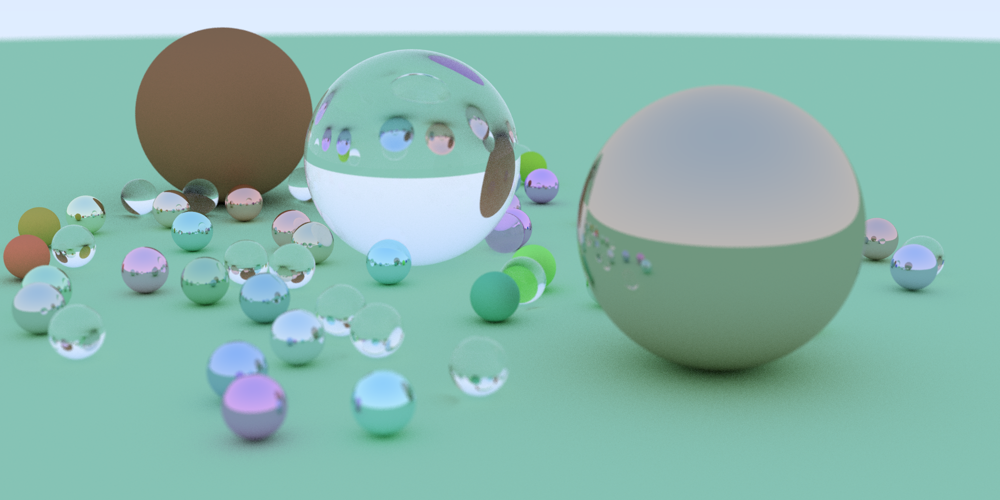

# Ray tracing processor

Inspired by [this article](https://github.com/petershirley/raytracinginoneweekend) and [this excellent rust course](https://www.youtube.com/playlist?list=PLlb7e2G7aSpTfhiECYNI2EZ1uAluUqE_e)

So this code does nothing but creating the image:

## Building  
Program was written with Rust 1.35.0  
For producing the image, run  
`./view.sh`  
It may take some time to finish a computation
